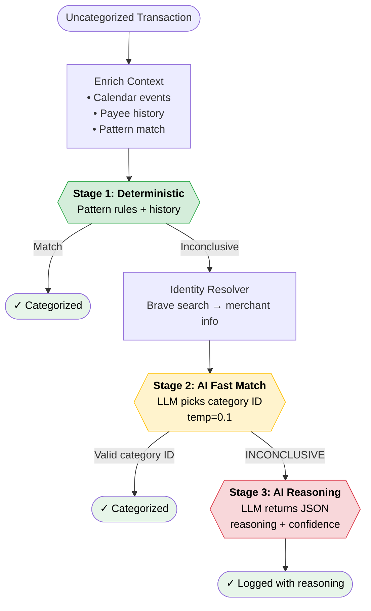

# Transaction Categorization Flow

High-level view of how an uncategorized transaction is processed through the three-tier cascade in `src/index.ts`.

## The three-tier cascade

| Tier | Cost | Method | Exit condition |
|---|---|---|---|
| **Stage 1** | Free | Deterministic pattern rules + historical payee count | `hasDeterministicMatch === true` |
| **Stage 2** | Cheap LLM call | Structured prompt, returns category ID or `INCONCLUSIVE` | Valid category ID returned |
| **Stage 3** | Expensive LLM call | Reasoning prompt, returns JSON with confidence | Always logs — terminal tier |

Identity resolution (Brave search) runs **between** Stage 1 and Stage 2 to enrich the prompt with merchant info when Stage 1 fails.
